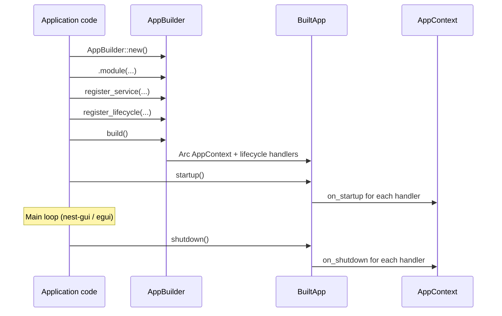

# Application & lifecycle

nest-core models application setup as a **build phase** followed by a **runtime phase**. Configuration happens on `AppBuilder`; runtime access goes through `AppContext` inside `BuiltApp`.

[`nest-app`](../nest-app/README.md) orchestrates the standard container on top of these primitives: metadata, bootstrap validation, and traced startup/shutdown. Host crates (`nest-cli`, `nest-tui`, `nest-gui`) execute the container and own presentation concerns (CLI parsing, event loops, logging init).

## Application flow



## AppBuilder

`AppBuilder` is the configuration entry point. Create one, add modules, register services and lifecycle handlers, then call `build()`.

### Construction

```rust
let builder = AppBuilder::new();
// or
let builder = AppBuilder::default();
```

### Module configuration

```rust
let app = AppBuilder::new()
    .module(UiModule)
    .module(ThemeModule);
```

`module()` consumes `self` and returns `Self` for chaining. It calls `Module::configure` immediately.

### Service registration

```rust
let mut app = AppBuilder::new();
app.register_service(Logger::new())?;
app.register_service(GitService::new())?;
```

Returns `NestResult<()>` — handle duplicate registration errors here.

### Lifecycle registration

```rust
app.register_lifecycle(AppLifecycle);
app.register_lifecycle(TelemetryLifecycle);
```

Returns `&mut Self` for chaining with other `register_*` methods that take `&mut self`.

### Extension-point registration (v1)

These methods collect metadata for introspection. Full behavior is implemented in downstream crates.

```rust
app.register_panel(ExplorerPanel);
app.register_command(OpenFileCommand);
app.register_job(IndexWorkspaceJob);
app.register_plugin(GitPlugin);
```

Introspection accessors:

```rust
let panels = app.panels();   // &[RegistrationInfo]
let commands = app.commands();
let jobs = app.jobs();
```

### Build

```rust
let built = app.build()?;
```

`build()` consumes the builder and returns `BuiltApp` with:

- `context: Arc<AppContext>` — frozen service registry
- Internal lifecycle handler list

After `build()`, the service registry cannot be modified.

## BuiltApp

`BuiltApp` represents a fully configured application ready to start.

```rust
pub struct BuiltApp {
    pub context: Arc<AppContext>,
    // lifecycle_handlers are internal
}
```

### Startup

```rust
built.startup()?;
```

Calls `on_startup` on each registered `Lifecycle` handler, in registration order. Propagates the first error and stops.

### Shutdown

```rust
built.shutdown()?;
```

Calls `on_shutdown` on each handler, in registration order.

### Typical usage with nest-app and nest-gui

```rust
use nest_app::NestApp;
use nest_gui::GuiApp;

let mut app = NestApp::builder("kiwi")
    .module(UiModule)
    .build()?;

app.startup()?;
// nest-gui runs the egui main loop with app.context_arc()
app.shutdown()?;
```

Hosts may also build the container in application `main` and pass it via `GuiApp::from_nest_app(app)`.

## AppContext

`AppContext` is the runtime handle for service lookup.

```rust
impl AppContext {
    pub fn service<T: Service>(&self) -> NestResult<&T>;
    pub fn has_service<T: Service>(&self) -> bool;
}
```

Created internally by `AppBuilder::build()` and shared via `Arc<AppContext>`:

```rust
let ctx = built.context.clone();

// Pass ctx into UI panels, commands, or closures
render_panel(&ctx);
```

**Immutability:** The registry inside `AppContext` is not exposed for mutation. Services are read-only after build.

## Lifecycle

The `Lifecycle` trait provides synchronous hooks:

```rust
pub trait Lifecycle: Send + 'static {
    fn on_startup(&mut self, ctx: &AppContext) -> NestResult<()> { Ok(()) }
    fn on_shutdown(&mut self, ctx: &AppContext) -> NestResult<()> { Ok(()) }
}
```

Default implementations are no-ops. Override only the hooks you need.

### When hooks run

| Hook | Timing |
|------|--------|
| `on_startup` | After `build()`, when `BuiltApp::startup()` is called, before main loop |
| `on_shutdown` | When `BuiltApp::shutdown()` is called, after main loop ends |

### Handler order

Handlers run in the order they were registered via `register_lifecycle`.

### Combining Module and Lifecycle

A single type can implement both traits, or you can use separate types:

```rust
struct GitModule;

impl Module for GitModule {
    fn configure(&self, app: &mut AppBuilder) {
        app.register_service(GitService::new()).unwrap();
        app.register_lifecycle(GitLifecycle);
    }
}

struct GitLifecycle;

impl Lifecycle for GitLifecycle {
    fn on_startup(&mut self, ctx: &AppContext) -> NestResult<()> {
        let git = ctx.service::<GitService>()?;
        git.connect()?;
        Ok(())
    }
}
```

### Async lifecycle (future)

Async startup and shutdown will live in `nest-tasks`:

```rust
// Planned for nest-tasks — not in nest-core v1
#[async_trait]
pub trait AsyncLifecycle {
    async fn on_startup_async(&mut self, ctx: &AppContext) -> NestResult<()>;
    async fn on_shutdown_async(&mut self, ctx: &AppContext) -> NestResult<()>;
}
```

nest-core intentionally does not depend on Tokio.
