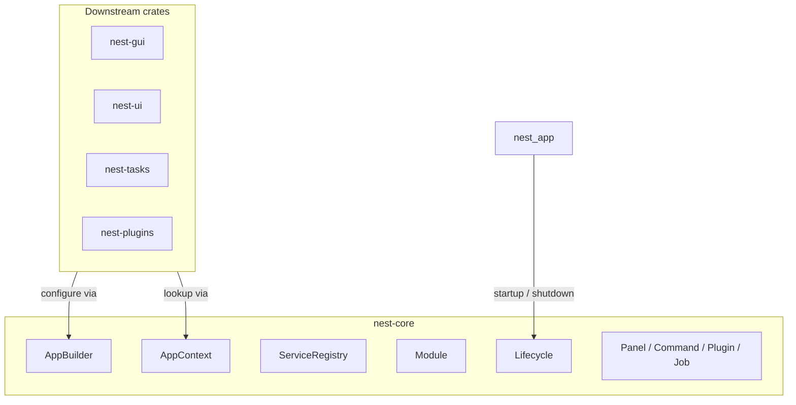

# Overview

## What is nest-core?

Nest is a modular application framework for Rust desktop apps built on top of egui. **nest-core** sits at the bottom of the stack. It does not render UI, run async tasks, or load plugins dynamically. Instead, it defines the contracts and infrastructure that other Nest crates build on.

nest-core answers three questions for every Nest application:

1. **How do features register themselves?** — Through `Module`, `Plugin`, and `AppBuilder`.
2. **How do components share state?** — Through an explicit singleton service registry.
3. **When does setup and teardown run?** — Through synchronous `Lifecycle` hooks.

## Design principles (v1)

### Small typed service registry

nest-core provides a **service registry**, not a full dependency injection container. There is no constructor injection, auto-wiring, service factories, or scoped lifetimes in v1.

```rust
// Register explicitly
app.register_service(GitService::new())?;

// Look up by concrete type
let git = ctx.service::<GitService>()?;
```

### Modular first

Every major feature lives in its own crate. Applications opt into functionality by adding modules. nest-core defines the `Module` trait and `AppBuilder` API that all modules use.

### Sync core, async elsewhere

Lifecycle hooks in nest-core are synchronous. Background work, cancellation, and progress belong in [`nest-task-runtime`](../nest-task-runtime/README.md) (Tokio-backed `TaskManagerService`).

### Dependency-light

nest-core has a single external dependency (`thiserror`). It does not depend on egui, Tokio, or proc-macro crates.

| Dependency | Purpose |
|------------|---------|
| `thiserror` | `NestError` derive |
| `std` | `HashMap`, `TypeId`, `Any` for the registry |

**MSRV:** Rust 1.75+ (edition 2021)

## Architecture



## What nest-core includes

| Component | Responsibility |
|-----------|----------------|
| `ServiceRegistry` | Store and retrieve singleton services by type |
| `AppContext` | Runtime facade for `service::<T>()?` lookup |
| `AppBuilder` | Configure modules, register services and extension points |
| `BuiltApp` | Frozen app state with `startup()` / `shutdown()` |
| `Module` | Configure the app during build |
| `Lifecycle` | Sync startup and shutdown hooks |
| `Service` | Marker trait for registrable types |
| `Panel`, `Command`, `Job`, `Plugin` | Extension-point contracts |
| `NestError` | Unified error type |

## What nest-core does not include

| Feature | Planned crate |
|---------|---------------|
| egui window and event loop | `nest-gui` |
| UI components | `nest-ui` |
| Background tasks, Tokio | `nest-tasks` |
| Event bus implementation | `nest-events` |
| Dynamic plugin loading | `nest-plugins` |
| Trait-object service lookup (`dyn Repository`) | v2 |
| Proc-macros (`Validate`, `NestForm`) | `nest-validation`, `nest-forms` |

## Source layout

```
crates/nest-core/src/
├── lib.rs          # Public re-exports and crate docs
├── builder.rs      # AppBuilder, BuiltApp
├── context.rs      # AppContext
├── registry.rs     # ServiceRegistry
├── module.rs       # Module trait
├── lifecycle.rs    # Lifecycle trait
├── error.rs        # NestError, NestResult
├── version.rs      # NEST_VERSION
└── traits/
    ├── mod.rs          # Panel, Command, Plugin
    ├── service.rs      # Service marker
    ├── registrable.rs  # RegistrationInfo
    └── job.rs          # Job stub
```

## Version

```rust
use nest_core::{NEST_VERSION, nest_version};

assert_eq!(nest_version(), NEST_VERSION);
```

Current crate version: **0.1.0**
