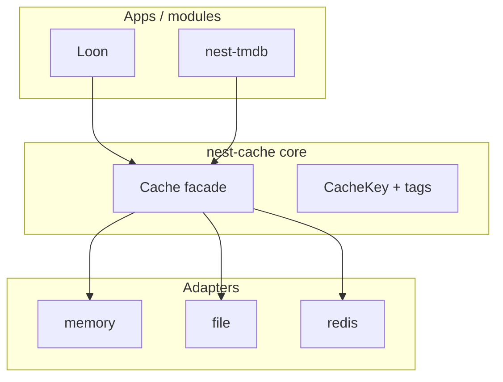

# nest-cache v1 Implementation Plan

## Status: Implemented

Placeholder plan for a **core** cache module. Crate directory exists at [`core/crates/nest-cache`](../../core/crates/nest-cache/README.md) with no implementation yet.

## Context

Several Nest crates need shared caching with explicit invalidation:

| Need | Today | With nest-cache |
|------|-------|-----------------|
| TMDB `/configuration` TTL | In-memory inside `TmdbClient` | `CacheKey` + tag `tmdb` |
| Loon poster/backdrop files | Deferred — remote URLs only | `nest-cache-file` under `{data_dir}/cache/` |
| Cross-request metadata | None | Memory or Redis adapter |

**Design principle:** `nest-cache` answers *how do we store and invalidate cached bytes?* — not *what is a movie?* or *how do we call TMDB?*

The crate must **not** know about Loon, webOS, TMDB DTOs, or HTTP routes.

## Crate boundaries

| Crate | Layer | Role |
|-------|-------|------|
| **`nest-cache`** | **core** | `Cache`, `CacheKey`, tags, invalidate API, `CacheAdapter` trait, `CacheModule` |
| `nest-cache-memory` | **core** or **module** (TBD) | In-process `HashMap` adapter — default for dev/tests |
| `nest-cache-file` | **module** | Disk-backed entries via scoped paths (`nest-file`) |
| `nest-cache-redis` | **module** | Redis adapter for multi-instance servers |



Same pattern as [`nest-data` v1](nest-data-v1.md): contracts in core, I/O in adapters.

## Hard boundaries

`nest-cache` **must not**:

- Embed Redis, filesystem, or HTTP client dependencies (adapters own I/O)
- Define domain types (movies, TMDB responses, etc.)
- Auto-invalidate without explicit tags or TTL

It **may** depend on:

- `nest-core` (`Module`, `AppBuilder`, service registration)
- `nest-error`
- `serde`, `serde_json` (value encoding in facade)
- `tracing`

## Responsibilities (v1 target)

```text
nest-cache
├── CacheKey              namespaced key (e.g. loon:poster:tmdb:348:w500)
├── CacheEntry            bytes + tags + optional expires_at
├── CacheAdapter trait    get / set / delete / invalidate_tag / clear
├── Cache                 typed facade over adapter (serde helpers)
├── CacheModule           registers default Cache service
├── CacheError + codes    NEST_CACHE_* → NestError
└── prelude
```

### Keys

- Opaque string with recommended `namespace:…` convention
- Helpers: `CacheKey::new("tmdb:configuration")`, `CacheKey::scoped("loon", "poster", id)`
- No glob delete on keys in v1 — use **tags** for bulk invalidation

### Tags

- Zero or more string tags per entry
- `cache.invalidate_tag("movies")` removes every entry tagged `movies`
- `cache.invalidate_tag("tmdb")` clears TMDB config + cached metadata blobs
- Adapters return count of entries removed

### Adapters

| Adapter | Storage | Typical use |
|---------|---------|-------------|
| **Memory** | `HashMap<CacheKey, CacheEntry>` | Unit tests, single-process, TMDB config |
| **File** | `{cache_root}/{hash(key)}.bin` + sidecar metadata JSON | Loon images, large blobs, survive restarts |
| **Redis** | Redis STRING keys + SET for tag index | Multi-node Loon, shared TMDB cache |

Each adapter implements `CacheAdapter`. v1 ships **memory** first; file and Redis are follow-up crates.

### File adapter sketch (nest-cache-file)

- Depends on `nest-file` for scoped writes under app cache root
- Entry layout: payload file + `.meta` JSON (tags, expires_at)
- Tag index: in-memory map rebuilt on startup, or sqlite sidecar (deferred)
- Loon: `tag = movie:{slug}`, `key = loon:artwork:{slug}:poster`

### Redis adapter sketch (nest-cache-redis)

- Key prefix configurable (`nest:cache:`)
- Tag → SET of cache keys; `invalidate_tag` uses SUNION + DEL
- Optional TTL via Redis EXPIRE mirroring `CacheEntry.expires_at`

## Public API (v1 target)

```rust
pub struct CacheKey(String);

impl CacheKey {
    pub fn new(value: impl Into<String>) -> Self;
    pub fn as_str(&self) -> &str;
}

pub struct CacheEntry {
    pub key: CacheKey,
    pub value: Vec<u8>,
    pub tags: Vec<String>,
    pub expires_at: Option<SystemTime>,
}

pub trait CacheAdapter: Send + Sync {
    fn get(&self, key: &CacheKey) -> CacheResult<Option<Vec<u8>>>;
    fn set(&self, entry: CacheEntry) -> CacheResult<()>;
    fn delete(&self, key: &CacheKey) -> CacheResult<()>;
    fn invalidate_tag(&self, tag: &str) -> CacheResult<u64>;
    fn clear(&self) -> CacheResult<()>;
}

pub struct Cache { /* Arc<dyn CacheAdapter> */ }

impl Cache {
    pub fn new(adapter: Arc<dyn CacheAdapter>) -> Self;
    pub fn get_json<T: DeserializeOwned>(&self, key: &CacheKey) -> CacheResult<Option<T>>;
    pub fn set_json<T: Serialize>(
        &self,
        key: CacheKey,
        value: &T,
        tags: &[&str],
        ttl: Option<Duration>,
    ) -> CacheResult<()>;
    pub fn get_bytes(&self, key: &CacheKey) -> CacheResult<Option<Vec<u8>>>;
    pub fn set_bytes(
        &self,
        key: CacheKey,
        value: Vec<u8>,
        tags: &[&str],
        ttl: Option<Duration>,
    ) -> CacheResult<()>;
    pub fn invalidate_tag(&self, tag: &str) -> CacheResult<u64>;
}
```

Async variant (`AsyncCacheAdapter`) deferred until a consumer requires it outside `spawn_blocking`.

## Module integration

```rust
pub const CACHE_MODULE_ID: ModuleId = ModuleId("nest-cache");

pub struct CacheModule {
    adapter: Arc<dyn CacheAdapter>,
}

impl Module for CacheModule {
    fn configure(&self, app: &mut AppBuilder) -> NestResult<()> {
        app.register_service(Cache::new(self.adapter.clone()))?;
        Ok(())
    }
}
```

Apps pick adapter at startup:

```rust
AppBuilder::new()
    .module(CacheModule::new(Arc::new(MemoryCacheAdapter::new())))
    // or FileCacheAdapter::scoped("./cache")?, RedisCacheAdapter::new(url)?, ...
```

## Error model

- `CacheError` + `CacheErrorKind` (`NotFound`, `Expired`, `Io`, `Adapter`, `Serialization`)
- `CacheResult<T>`
- `NEST_CACHE_*` codes
- `impl From<CacheError> for NestError`

## Workspace layout (target)

```text
core/crates/nest-cache/
├── Cargo.toml
└── src/
    ├── lib.rs
    ├── prelude.rs
    ├── codes.rs
    ├── error.rs
    ├── key.rs
    ├── entry.rs
    ├── adapter.rs
    ├── cache.rs
    └── module.rs

modules/crates/nest-cache-file/     # follow-up
modules/crates/nest-cache-redis/    # follow-up
```

Root `Cargo.toml`: add `nest-cache` to members when implementation begins.

## v1 scope

### Ship in v1

- `CacheKey`, `CacheEntry`
- `CacheAdapter` trait
- `Cache` facade (bytes + JSON helpers)
- `MemoryCacheAdapter` (in `nest-cache` or `nest-cache-memory`)
- Tag invalidation on memory adapter
- TTL enforcement on read (lazy expiry)
- `CacheModule` + service registration
- `CacheError` + tests

### Explicitly deferred

| Feature | Target |
|---------|--------|
| `nest-cache-file` disk adapter | [v1 plan](nest-cache-file-v1.md) — Loon artwork cache |
| `nest-cache-redis` | v1.2 — multi-instance |
| Async adapter trait | When HTTP server needs non-blocking cache |
| `nest-config` `[cache]` section | v1.1 |
| Cache statistics / metrics | v1.2 |
| Compression | later |

## Consumers

| Crate | Integration |
|-------|-------------|
| [nest-tmdb v1](nest-tmdb-v1.md) | Replace inline config cache; tag `tmdb` |
| [Loon v1](../../apps/loon/docs/v1.md) | Optional `nest-cache-file` for poster/backdrop bytes |
| nest-http-serve | Response cache (future) |

## Testing strategy

| Test | Type |
|------|------|
| set / get / delete | Unit |
| TTL expiry on get | Unit |
| invalidate_tag removes tagged entries only | Unit |
| JSON round-trip via facade | Unit |
| File adapter crash recovery | Integration (deferred) |

## Follow-up

- Implement `core/crates/nest-cache` crate
- Add `docs/nest-cache/README.md` status → Implemented
- Plan [nest-cache-file v1](nest-cache-file-v1.md) for Loon artwork cache
- Wire Loon `GET /api/artwork/:slug/:kind` when enabled
- Run `./scripts/index-memory.sh` after doc changes

## Related

- [nest-cache README](../nest-cache/README.md)
- [Placeholder crate README](../../core/crates/nest-cache/README.md)
- [nest-data v1](nest-data-v1.md) — contracts + adapter pattern
- [nest-tmdb v1](nest-tmdb-v1.md) — first consumer candidate
- [architecture.md](../architecture.md)
