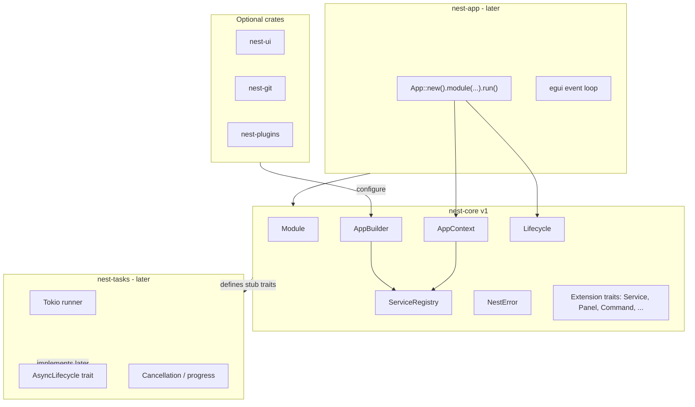
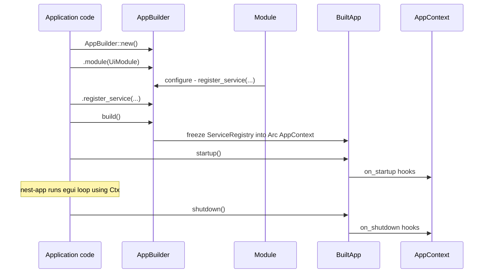

# nest-core v1 Implementation Plan

## Context

The [README.md](../../README.md) defines Nest as a modular Rust/egui desktop framework. This plan scopes **nest-core v1** only—the foundation crate that defines contracts, not features.

**Design decisions (confirmed):**
- Runtime registration + typed lookup (not constructor injection, macros, or scoped lifetimes)
- Sync lifecycle in core; async execution deferred to future `nest-tasks`
- Core stays small: few dependencies, no egui, no Tokio

---

## Boundaries



| In nest-core v1 | Out of scope (later crates) |
|-----------------|----------------------------|
| `ServiceRegistry`, typed `service::<T>()` | Constructor injection, auto-wiring |
| `Module::configure` | egui window / render loop (`nest-app`) |
| Sync `Lifecycle` hooks | Tokio, task runner (`nest-tasks`) |
| `AppBuilder` registration API | `register_panel`, `register_command` implementations |
| Extension traits (empty contracts) | Trait-object DI (`dyn Repository`) |
| `NestError`, `NestResult` | Proc-macros (`Validate`, `NestForm`) |

---

## Crate Setup

### Workspace layout (minimal bootstrap)

```
nest/
├── Cargo.toml          # workspace root
├── README.md
└── crates/
    └── nest-core/
        ├── Cargo.toml
        └── src/
            ├── lib.rs
            ├── error.rs
            ├── module.rs
            ├── builder.rs
            ├── context.rs
            ├── registry.rs
            ├── lifecycle.rs
            ├── version.rs
            └── traits/
                ├── mod.rs
                ├── service.rs
                ├── registrable.rs   # shared registration metadata
                └── job.rs           # optional stub for nest-tasks
```

### `nest-core` dependencies (v1)

| Crate | Purpose | Required? |
|-------|---------|-----------|
| `thiserror` | `NestError` derive | Yes |
| `std` only | `HashMap` + `TypeId` registry | Yes |
| `egui`, `tokio`, `async-trait` | — | **No** |

**MSRV:** Pin Rust **1.75+** (edition 2021) in workspace `rust-version`. No nightly features.

### Public API surface (`lib.rs`)

Re-export the stable v1 surface:

```rust
pub use builder::AppBuilder;
pub use context::AppContext;
pub use error::{NestError, NestResult};
pub use lifecycle::Lifecycle;
pub use module::Module;
pub use registry::ServiceRegistry;
pub use version::{NEST_VERSION, nest_version};
```

---

## Core Types

### 1. Error handling — [`error.rs`](../../crates/nest-core/src/error.rs)

Single error enum for core operations. Keep variants minimal and actionable:

```rust
#[derive(Debug, thiserror::Error)]
pub enum NestError {
    #[error("service not registered: {0}")]
    ServiceNotFound(&'static str),

    #[error("service already registered: {0}")]
    ServiceAlreadyRegistered(&'static str),

    #[error("module configuration failed: {0}")]
    ModuleError(String),

    #[error("lifecycle error: {0}")]
    LifecycleError(String),

    #[error("{0}")]
    Other(String),
}

pub type NestResult<T> = Result<T, NestError>;
```

Modules may wrap their own errors into `ModuleError` / `LifecycleError` strings in v1; a structured error chain can come later.

---

### 2. Service contract — [`traits/service.rs`](../../crates/nest-core/src/traits/service.rs)

```rust
/// Marker: types registered in the service registry.
/// v1: no methods required; keeps registration unconstrained.
pub trait Service: Send + Sync + 'static {}
impl<T: Send + Sync + 'static> Service for T {}
```

**v1 rules enforced by API:**
- Singleton only (one instance per type)
- `Send + Sync + 'static`
- Registered explicitly; no factory/lazy resolution in v1

---

### 3. ServiceRegistry — [`registry.rs`](../../crates/nest-core/src/registry.rs)

Internal storage: `HashMap<TypeId, Box<dyn Service>>` is wrong (no downcast). Use **`HashMap<TypeId, Box<dyn Any + Send + Sync>>`** with typed insert/get.

```rust
pub struct ServiceRegistry {
    services: HashMap<TypeId, Box<dyn Any + Send + Sync>>,
}

impl ServiceRegistry {
    pub fn register<T: Service>(&mut self, service: T) -> NestResult<()> { ... }
    pub fn get<T: Service>(&self) -> NestResult<&T> { ... }
    pub fn contains<T: Service>(&self) -> bool { ... }
    // get_mut for v1 if needed by lifecycle; prefer &T for read-only access
}
```

**Behavior:**
- `register` → `ServiceAlreadyRegistered` on duplicate `TypeId`
- `get` → `ServiceNotFound` with `type_name::<T>()` for debuggability
- No `remove` in v1 (YAGNI)
- Unit tests: register, lookup, duplicate error, missing error

---

### 4. AppContext — [`context.rs`](../../crates/nest-core/src/context.rs)

Thin facade over `ServiceRegistry` for use during runtime and lifecycle hooks:

```rust
pub struct AppContext {
    services: ServiceRegistry,
    // v1: optional metadata bag (app name, data dir) — keep minimal
}

impl AppContext {
    pub fn service<T: Service>(&self) -> NestResult<&T> {
        self.services.get::<T>()
    }

    pub(crate) fn registry_mut(&mut self) -> &mut ServiceRegistry { ... }
}
```

`AppContext` is created once at build completion and shared (via `Arc<AppContext>` or `&AppContext`) with modules during lifecycle. **Decision for v1:** use `Arc<AppContext>` so egui UI closures and background modules can hold a handle; registry interior is immutable after startup (no `register` on context post-build).

---

### 5. AppBuilder — [`builder.rs`](../../crates/nest-core/src/builder.rs)

Fluent builder used during module configuration. Owns mutable state; produces frozen `AppContext` on `build()`.

```rust
pub struct AppBuilder {
    services: ServiceRegistry,
    modules: Vec<Box<dyn Module>>,
    lifecycle_handlers: Vec<Box<dyn Lifecycle>>,
}

impl AppBuilder {
    pub fn new() -> Self { ... }

    pub fn module<M: Module + 'static>(mut self, module: M) -> Self {
        module.configure(&mut self);
        self.modules.push(Box::new(module));
        self
    }

    /// Explicit registration — primary v1 API
    pub fn register_service<T: Service>(&mut self, service: T) -> NestResult<()> {
        self.services.register(service)
    }

    pub fn register_lifecycle<L: Lifecycle + 'static>(&mut self, handler: L) -> &mut Self { ... }

    pub fn build(self) -> NestResult<BuiltApp> { ... }
}

pub struct BuiltApp {
    pub context: Arc<AppContext>,
    lifecycle_handlers: Vec<Box<dyn Lifecycle>>,
}

impl BuiltApp {
    pub fn startup(&mut self) -> NestResult<()> { ... }
    pub fn shutdown(&mut self) -> NestResult<()> { ... }
}
```

**Note:** `Module::configure` receives `&mut AppBuilder`, matching README. `module()` calls `configure` immediately (eager), not deferred—simpler ordering, easier debugging.

**Registration extensions (stubs only in v1):** Add no-op or collect-only methods so downstream crates compile against stable signatures:

```rust
// v1: store type_name / TypeId in a Vec for introspection; no behavior
pub fn register_panel<P: Panel>(&mut self, _panel: P) -> &mut Self { self }
pub fn register_command<C: Command>(&mut self, _command: C) -> &mut Self { self }
```

Full panel/command registries live in `nest-commands`, `nest-ui`, etc., but they implement `Panel` / `Command` traits defined in core.

---

### 6. Module trait — [`module.rs`](../../crates/nest-core/src/module.rs)

```rust
pub trait Module: Send + Sync + 'static {
    fn configure(&self, app: &mut AppBuilder);
}
```

**Example module (documentation / test):**

```rust
pub struct LoggingModule;

impl Module for LoggingModule {
    fn configure(&self, app: &mut AppBuilder) {
        app.register_service(Logger::new()).expect("logger");
    }
}
```

**Module ordering:** v1 uses registration order only. No dependency graph or topological sort until a real need appears (e.g. plugin load order).

---

### 7. Lifecycle — [`lifecycle.rs`](../../crates/nest-core/src/lifecycle.rs)

Sync hooks only:

```rust
pub trait Lifecycle: Send + 'static {
    fn on_startup(&mut self, ctx: &AppContext) -> NestResult<()> { Ok(()) }
    fn on_shutdown(&mut self, ctx: &AppContext) -> NestResult<()> { Ok(()) }
}
```

`BuiltApp::startup()` / `shutdown()` iterate `lifecycle_handlers` in registration order. Modules that need lifecycle can implement both `Module` and `Lifecycle`, or register a separate handler.

**Future hook (document in code comment, not implemented):**

```rust
// nest-tasks will introduce AsyncLifecycle with tokio::spawn for on_startup_async
```

---

### 8. Extension traits — [`traits/`](../../crates/nest-core/src/traits/)

Define empty or minimal contracts so optional crates share types without coupling:

| Trait | v1 definition | Implemented by |
|-------|---------------|----------------|
| `Service` | marker | all registered services |
| `Panel` | `fn id(&self) -> &str` | `nest-ui`, `nest-docking` |
| `Command` | `fn id(&self) -> &str`, `fn title(&self) -> &str` | `nest-commands` |
| `Plugin` | `fn register(&self, app: &mut AppBuilder)` | `nest-plugins` |
| `Job` | `fn id(&self) -> &str` (stub) | `nest-tasks` |

`Plugin` mirrors README; it calls `configure`-style registration on `AppBuilder`.

**Defer to v2:** `register_service_as::<dyn Trait, Impl>()` — document as extension point in `registry.rs` comments.

---

### 9. Version — [`version.rs`](../../crates/nest-core/src/version.rs)

```rust
pub const NEST_VERSION: &str = env!("CARGO_PKG_VERSION");
pub fn nest_version() -> &'static str { NEST_VERSION }
```

---

## Build / Startup Flow (v1)



`nest-app` (separate follow-up plan) will wrap:

```rust
App::new().module(UiModule).run();
// internally: build() -> startup() -> egui loop -> shutdown()
```

---

## Testing Strategy

All tests in `nest-core` (no egui):

| Test | Validates |
|------|-----------|
| `register_and_get_service` | happy path typed lookup |
| `duplicate_registration_fails` | `ServiceAlreadyRegistered` |
| `missing_service_fails` | `ServiceNotFound` with type name |
| `module_registers_service` | `Module::configure` integration |
| `lifecycle_startup_shutdown_called` | hook order and `AppContext` access |
| `build_freezes_registry` | no post-build registration (compile-time or runtime guard) |

Use `cargo test -p nest-core` in CI.

---

## Documentation Deliverables

Within crate (not new top-level markdown files unless requested):

- Crate-level `//!` docs on design principles and v1 limitations
- Doc examples on `AppBuilder`, `Module`, `service()` lookup
- `#[doc = "..."]` on deferred features (trait-object DI, async lifecycle, scoped lifetimes)

---

## Implementation Phases

### Phase 1 — Scaffold (day 1)
- Root workspace `Cargo.toml` with `crates/nest-core`
- `nest-core/Cargo.toml` with `thiserror`
- `lib.rs` module tree + `version.rs`

### Phase 2 — Registry + errors (day 1–2)
- `NestError`, `ServiceRegistry`, `Service` marker
- Unit tests for register/get/error cases

### Phase 3 — Builder + context (day 2)
- `AppBuilder`, `AppContext`, `BuiltApp`
- `build()` freezes registry into `Arc<AppContext>`

### Phase 4 — Module + lifecycle (day 2–3)
- `Module`, `Lifecycle`, `BuiltApp::startup/shutdown`
- Integration test with two modules + lifecycle handler

### Phase 5 — Extension traits + stubs (day 3)
- `Panel`, `Command`, `Plugin`, `Job` traits
- Stub `register_*` methods on `AppBuilder` (collect-only)

### Phase 6 — Polish (day 3–4)
- Doc comments, `#![deny(missing_docs)]` on public API (optional but recommended)
- `.gitignore` for `target/`
- Minimal CI: `cargo fmt --check`, `cargo clippy`, `cargo test`

---

## Explicit Non-Goals (v1)

- Constructor injection or service factories
- Proc-macros for registration or validation
- Scoped / transient lifetimes
- `dyn Trait` service lookup
- Tokio, async traits, or task execution
- egui integration
- Plugin dynamic loading (`.so` / DLL)
- Feature flags beyond optional `std` (always on for desktop)

---

## Success Criteria

nest-core v1 is complete when:

1. A consumer crate can depend on `nest-core`, define a `Module`, register singleton services, `build()`, run sync lifecycle, and resolve `ctx.service::<T>()?` without panics.
2. The crate has **zero** egui/Tokio dependencies and **< 10** direct dependencies total.
3. All unit/integration tests pass; public API is documented.
4. Extension traits exist so `nest-app` and `nest-ui` can be planned without changing core's DI model.

---

## Follow-Up (out of this plan)

| Crate | Depends on | Adds |
|-------|------------|------|
| `nest-app` | `nest-core`, `eframe`/`egui` | `App::run()`, window, main loop |
| `nest-events` | `nest-core` | event bus implementing core event traits |
| `nest-tasks` | `nest-core` | Tokio, `AsyncLifecycle`, `Job` runner |
| `nest-plugins` | `nest-core` | `Plugin` orchestration, optional dynamic load |
