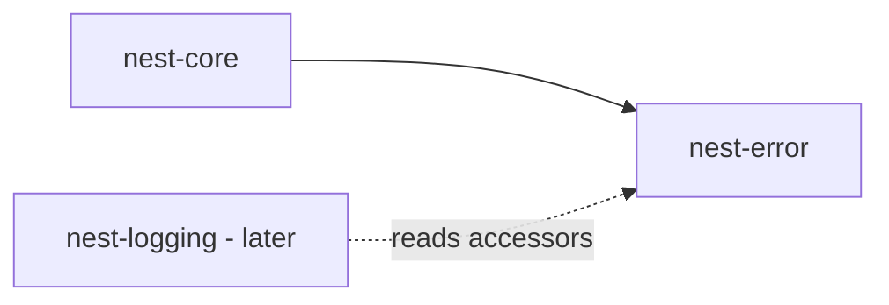

# nest-error v1 Implementation Plan

## Context

[nest-core](../../core/crates/nest-core) previously owned a temporary `NestError` enum. **nest-error** is now the single owner of error shape and reporting. `nest-logging` is out of scope — only integration hooks are defined.

**Rule:**
- **nest-error** owns error shape and `NestErrorReport`
- **nest-logging** (later) owns where/how errors are emitted via `tracing`

## Status: Implemented

All success criteria met. See [nest-error docs](../nest-error/README.md).

## Dependency graph



## Crate layout

```
core/crates/nest-error/src/
├── lib.rs
├── kind.rs
├── error.rs
├── codes.rs
├── context.rs
├── report.rs
└── prelude.rs
```

## Core types

- `NestResult<T> = Result<T, NestError>`
- `NestErrorKind` — Config, Io, Validation, Data, Command, Service, Module, Plugin, Task, Ui, Auth, Network, Unknown
- `NestError` — struct with kind, message, code, module, operation, help, source
- `NestResultExt` — context chaining without anyhow
- `NestErrorReport` — UI/CLI snapshot
- `NestErrorFields` — logging adapter (no tracing dep)

## nest-core migration

- `nest-core` depends on `nest-error`, deleted `error.rs`
- Re-exports: `NestError`, `NestErrorKind`, `NestErrorReport`, `NestResult`, `NestResultExt`, `NestErrorFields`
- Service errors use `service_not_found()` / `service_already_registered()`

## Optional features

| Feature | Enables |
|---------|---------|
| `serde` | Serialize metadata (source omitted) |
| `diagnostics` | miette `Diagnostic` + `diagnostic_report()` |

## Logging hooks

nest-error exposes `kind()`, `code()`, `module()`, `operation()`, `help()`, `message()`, `source()`, `fields()`, `report()` for future nest-logging. No tracing dependency in v1.

## Non-goals (v1)

- nest-logging implementation
- tracing dependency in nest-error
- anyhow dependency
- backtrace capture

## Follow-up

| Crate | Adds |
|-------|------|
| `nest-logging` | tracing subscriber, file/console sinks, panic hook |
| `nest-cli` | miette terminal rendering |
| `nest-ui` | dialog/toast from `NestErrorReport` |
