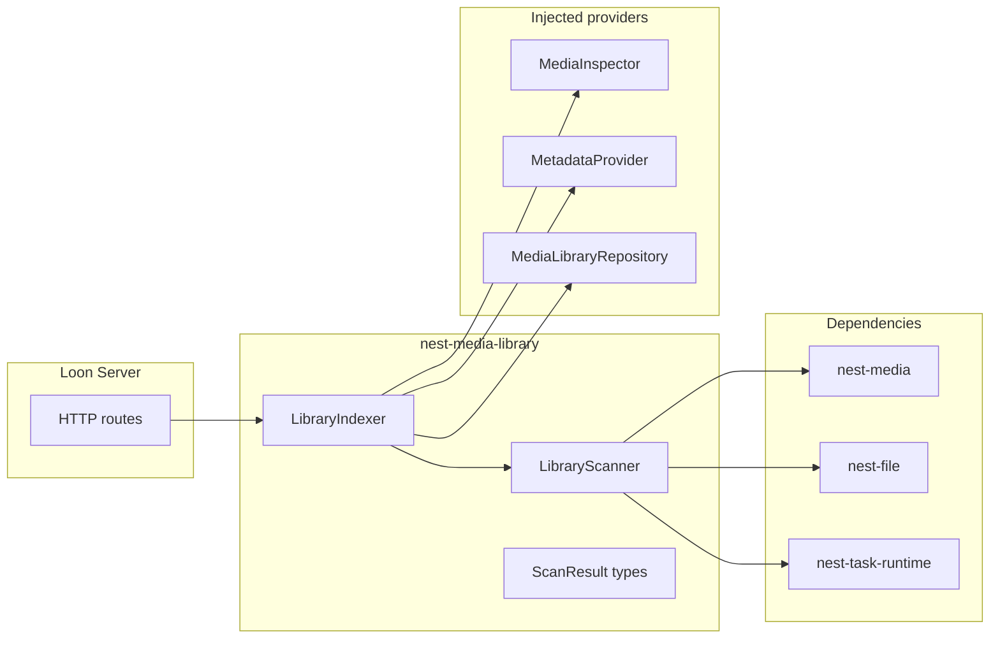
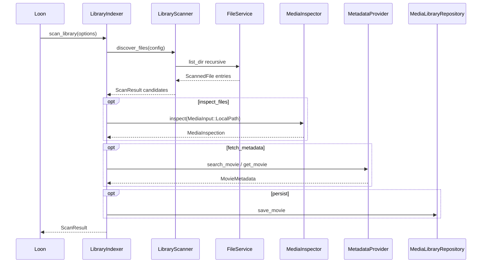

# nest-media-library v1 Implementation Plan

## Status: Implemented

Implements library scanning and indexing behavior deferred from [nest-media v1](nest-media-v1.md).

## Context

[nest-media](../nest-media/README.md) defines **what media is** — movies, tracks, artwork, and provider trait contracts. `nest-media-library` answers **how do we discover and index files into a library?**

**Design principle:** `nest-media-library` orchestrates filesystem discovery and optional enrichment via injected providers. It does not define core media types, serve HTTP, call TMDB, invoke FFmpeg, or persist to SQLite.

The crate must **not** know about Loon, webOS, or any specific app.

## Crate boundaries

| Crate | Layer | Role |
|-------|-------|------|
| `nest-media` | **core** | Domain models + provider traits |
| **`nest-media-library`** | **module** | Library config, filesystem scan, scan results, indexing orchestration |
| `nest-file` | **core** | Scoped sync file I/O (`list_dir`, metadata) |
| `nest-tmdb` (future) | **module** | `MetadataProvider` implementation — [README](../nest-tmdb/README.md) |
| `nest-transcode` | **module** | `MediaInspector` via FFprobe — [README](../nest-transcode/README.md) |
| `nest-data-sqlite` | **module** (existing) | `MediaLibraryRepository` persistence |



### Hard boundaries

`nest-media-library` **must not**:

- Serve HTTP (`nest-http-serve`)
- Open SQLite / implement `MediaLibraryRepository` schema
- Call TMDB or other metadata HTTP APIs directly
- Invoke FFmpeg / FFprobe directly
- Define core `Movie` / `MediaItem` types (use `nest-media`)

It **may** depend on:

- `nest-media` (models + provider trait bounds)
- `nest-file` (`FileService` for scoped directory walks)
- `nest-core` (`Module`, `AppBuilder`, service registration)
- `nest-error`
- `nest-task` + `nest-task-runtime` (long scans via `spawn_blocking` / `TaskManager::spawn`)
- `nest-config` (optional `[media-library]` section — v0.1 stretch)
- `tracing`, `serde`, `async-trait`, `tokio`

## Responsibilities

```text
nest-media-library
├── Library config          MediaLibraryConfig, LibraryId
├── Scan models             ScanResult, ScannedFile, MovieScanCandidate, ScanStats
├── Filesystem scanner      walk roots via FileService, filter video extensions
├── Filename heuristics     parse title/year from path (basic regex)
├── LibraryScanner          produces ScanResult (discover only)
├── LibraryIndexer          orchestrates scan + optional inspect + metadata + persist
├── MediaLibraryModule      registers LibraryScanner / LibraryIndexer services
└── Scan task               nest-task wrapper for background library scans
```

### Scan pipeline



**Key decision:** `LibraryScanner` is **discovery-only**. `LibraryIndexer` is the optional orchestrator that calls injected traits. Loon can run scan-only first, then wire TMDB + SQLite later.

## Core types

### Library identity and config

```rust
pub struct LibraryId(pub String);

pub struct MediaLibraryConfig {
    pub id: LibraryId,
    pub roots: Vec<String>,              // paths relative to FileService scope
    pub video_extensions: Vec<String>,   // e.g. ["mkv", "mp4", "avi"]
    pub follow_symlinks: bool,           // default false
}
```

### Scan result models

Deferred from `nest-media` — they belong here:

```rust
pub struct ScannedFile {
    pub relative_path: String,
    pub size_bytes: u64,
    pub modified_secs: Option<u64>,
}

pub struct MovieScanCandidate {
    pub file: ScannedFile,
    pub guessed_title: Option<String>,
    pub guessed_year: Option<u16>,
    pub inspection: Option<MediaInspection>,   // from nest-media
    pub metadata: Option<MovieMetadata>,       // from nest-media
    pub status: ScanItemStatus,
}

pub enum ScanItemStatus {
    New,
    Updated,
    Unchanged,
    Skipped,
    Error,
}

pub struct ScanError {
    pub path: String,
    pub message: String,
}

pub struct ScanStats {
    pub files_seen: u32,
    pub candidates: u32,
    pub errors: u32,
}

pub struct ScanResult {
    pub library_id: LibraryId,
    pub started_at: u64,
    pub finished_at: u64,
    pub candidates: Vec<MovieScanCandidate>,
    pub errors: Vec<ScanError>,
    pub stats: ScanStats,
}
```

### Services

```rust
pub struct LibraryScanOptions {
    pub inspect_files: bool,
    pub fetch_metadata: bool,
    pub persist: bool,
}

pub trait LibraryScanner: Send + Sync {
    fn discover(&self, config: &MediaLibraryConfig) -> LibraryResult<ScanResult>;
}

#[async_trait]
pub trait LibraryIndexer: Send + Sync {
    async fn scan_library(
        &self,
        config: &MediaLibraryConfig,
        options: LibraryScanOptions,
    ) -> LibraryResult<ScanResult>;
}
```

`LibraryScanner::discover` runs filesystem walk **sync** inside `spawn_blocking` when called from async indexer (matches [nest-file](../nest-file/README.md) sync I/O guidance).

### Filename heuristics (v0.1)

Basic parsing only — no ML, no online lookup:

- `Movies/Alien (1979)/Alien (1979).mkv` → title `Alien`, year `1979`
- `Alien.1979.1080p.mkv` → title `Alien`, year `1979`
- Unparseable → `guessed_title: None`, still listed as candidate

Implement in `src/parse/filename.rs` with unit tests.

## Module integration

Follow [nest-airtable](../../modules/crates/nest-airtable/src/module.rs) module pattern:

```rust
pub const MEDIA_LIBRARY_MODULE_ID: ModuleId = ModuleId("nest-media-library");

pub struct MediaLibraryModule { ... }

impl Module for MediaLibraryModule {
    fn dependencies(&self) -> &'static [ModuleId] {
        &[FILE_MODULE_ID]
    }
    fn configure(&self, app: &mut AppBuilder) -> NestResult<()> {
        // register LibraryScanner + LibraryIndexer with injected providers
    }
}
```

Constructor accepts optional `Arc<dyn MetadataProvider>`, `Arc<dyn MediaInspector>`, `Arc<dyn MediaLibraryRepository>` — all `None` in v0.1 scan-only mode.

## Error model

Own error type (do not overload `MediaError`):

- `LibraryError` + `LibraryErrorKind` (`Scan`, `Config`, `Provider`, `Inspection`, `Repository`, `Io`)
- `LibraryResult<T>`
- `NEST_MEDIA_LIBRARY_*` codes in `codes.rs`
- `impl From<LibraryError> for NestError`

Map `FileError` → `LibraryError` at boundaries.

## Workspace layout

```text
modules/crates/nest-media-library/
├── Cargo.toml
└── src/
    ├── lib.rs
    ├── prelude.rs
    ├── codes.rs
    ├── error.rs
    ├── config.rs
    ├── scan/
    │   ├── mod.rs
    │   ├── models.rs
    │   ├── scanner.rs
    │   └── stats.rs
    ├── parse/
    │   └── filename.rs
    ├── indexer.rs
    ├── module.rs
    └── task.rs
```

Root `Cargo.toml`: add `modules/crates/nest-media-library` to members + workspace dependencies.

### Draft `Cargo.toml`

```toml
[dependencies]
nest-core = { workspace = true }
nest-error = { workspace = true }
nest-file = { workspace = true }
nest-media = { workspace = true, features = ["async", "serde"] }
nest-task = { workspace = true }
async-trait = "0.1"
serde = { version = "1", features = ["derive"] }
tracing = "0.1"
tokio = { version = "1", features = ["rt-multi-thread"] }
```

## Loon usage

```rust
// v0.1: scan-only
let scanner = ctx.service::<LibraryScanner>()?;
let result = scanner.discover(&config)?;

// v0.2+: full pipeline when providers wired
let indexer = ctx.service::<LibraryIndexer>()?;
let result = indexer.scan_library(&config, LibraryScanOptions {
    inspect_files: true,
    fetch_metadata: true,
    persist: true,
}).await?;
```

HTTP route `POST /api/library/scan` lives in **Loon**, not this crate.

```text
loon-server
├── nest-http-serve
├── nest-media
├── nest-media-library
├── nest-stream          # future
├── nest-file
├── nest-tmdb            # future
├── nest-data-sqlite
└── nest-config
```

## v0.1 scope checklist

### Ship in v0.1

- [x] `LibraryId`, `MediaLibraryConfig`
- [x] Scan models: `ScanResult`, `ScannedFile`, `MovieScanCandidate`, `ScanStats`, `ScanError`, `ScanItemStatus`
- [x] `LibraryScanner` — recursive directory walk via `FileService`
- [x] Video extension filter
- [x] Filename title/year heuristics
- [x] `LibraryIndexer` — orchestrates discover + optional injected providers
- [x] `MediaLibraryModule` + service registration
- [x] `LibraryScanTask` wrapping indexer for `TaskManager::spawn`
- [x] `LibraryError` + `NestError` conversion
- [x] Unit tests: filename parsing, scanner on temp dir fixture

### Explicitly deferred

| Feature | Target |
|---------|--------|
| TV show / season folder layouts | v0.2 |
| NFO / sidecar metadata parsing | v0.2 |
| Duplicate detection / hash comparison | v0.2 |
| Watch folders / inotify auto-rescan | v0.3 |
| `nest-config` `[media-library]` auto-load | v0.2 |
| Default `MediaInspector` (FFprobe) | `nest-transcode` — [plan](nest-transcode-v1.md) |
| Default `MetadataProvider` | `nest-tmdb` |
| Default `MediaLibraryRepository` | Loon + `nest-data-sqlite` |
| Collections / playlists | later |

## Testing strategy

| Test | Type |
|------|------|
| Filename parse cases | Unit |
| Extension filter | Unit |
| Scanner on temp directory tree | Integration |
| Indexer with mock providers | Unit (async) |
| `LibraryError` → `NestError` | Unit |

## Follow-up

- Implement `modules/crates/nest-media-library` per this plan
- Add `docs/nest-media-library/README.md`
- [nest-tmdb v1](nest-tmdb-v1.md) — TMDB metadata provider
- [nest-transcode v1](nest-transcode-v1.md) — FFprobe media inspection

## Related

- [nest-media v1](nest-media-v1.md) — domain models and provider traits
- [nest-media README](../nest-media/README.md)
- [nest-file README](../nest-file/README.md) — scoped filesystem I/O
- [nest-task README](../nest-task/README.md) — background scan tasks
- [Loon README](../../apps/loon/README.md)
- [Loon v1 plan](../../apps/loon/docs/v1.md) — product implementation plan
- [architecture.md](../architecture.md)
