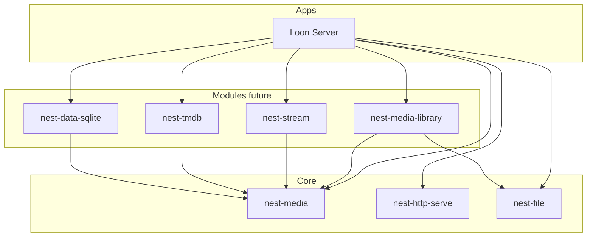

# nest-media v1 Implementation Plan

## Status: Implemented

See [nest-media docs](../nest-media/README.md).

## Context

Loon and future Nest media apps need a **reusable media domain layer**. `nest-media` answers:

- What is a movie?
- What is a media item?
- What is artwork?
- What are audio/video/subtitle tracks?
- What metadata do we store?
- What provider contracts exist for metadata, inspection, and persistence?

**Design principle:** `nest-media` answers *what is media?* — not *how do we serve, store, scan, or transcode it?*

The crate must **not** know about Loon, webOS, HTTP, FFmpeg, TMDB, SQLite, or filesystem crawling.

## Crate boundaries

| Crate | Layer | Role |
|-------|-------|------|
| `nest-media` | **core** | Domain models + provider traits |
| `nest-media-library` | **module** (planned) | Scanning / indexing — see [nest-media-library v1](nest-media-library-v1.md) |
| `nest-stream` | **core** or **module** (future) | Byte-range video streaming |
| `nest-tmdb` | **module** (planned) | `MetadataProvider` implementation — [plan](nest-tmdb-v1.md) |
| `nest-transcode` | **module** (planned) | FFprobe inspection + future FFmpeg jobs — [plan](nest-transcode-v1.md) |
| `nest-data-sqlite` | **module** (existing) | `MediaLibraryRepository` persistence |



### Hard boundaries

`nest-media` **must not** depend on or implement:

- HTTP / axum / `nest-http-serve`
- Database / SQL / `nest-data` / `nest-data-sqlite`
- FFmpeg / transcoding
- TMDB HTTP client
- Filesystem crawling / `nest-file` I/O

It **may** depend on:

- `nest-error` (error conversion)
- `serde` (optional feature for API serialization)
- `async-trait` (optional `async` feature for provider traits)

**No `nest-core` Module in v0.1** — apps wire trait implementations directly. A `MediaModule` can come in v0.2.

## Core types (v0.1 — movie focus)

### Identifiers and kind

```rust
pub struct MediaId(pub String);
pub struct ExternalMediaId(pub String);

pub enum MediaKind {
    Movie, TvShow, Season, Episode, HomeVideo, Unknown,
}
```

`MediaKind` includes future variants; v0.1 implements movie-specific models and traits only.

### Movie

Primary v0.1 entity: `id`, `title`, `original_title`, `sort_title`, `year`, `runtime_seconds`, `rating`, `summary`, `genres`, `cast`, `crew`, `artwork`, `tracks`, `external_ids`.

`PersonCredit` is a small value type (`name`, `role`, optional `character`) — not a people database.

### MediaItem

Lightweight cross-kind summary for list endpoints before full `Movie` hydration.

### Tracks and artwork

`MediaTracks`, `VideoTrack`, `AudioTrack`, `SubtitleTrack`, `HdrFormat`, `Artwork`, `ArtworkKind`, `ArtworkSource`, `ExternalIds`.

### Metadata search

`MovieSearchQuery`, `MovieSearchResult`, `MovieMetadata` — provider-normalized search and fetch types.

### Inspection (minimal)

```rust
pub enum MediaInput { LocalPath(String) }
pub struct MediaInspection { pub tracks: MediaTracks, pub duration_seconds: Option<u32>, ... }
```

Scan result models belong in **`nest-media-library`**, not `nest-media`.

## Provider traits (definitions only)

| Trait | Implementation crate |
|-------|---------------------|
| `MetadataProvider` | `nest-tmdb` |
| `MediaInspector` | `nest-transcode` or `nest-media-library` |
| `MediaLibraryRepository` | `nest-data-sqlite` (Loon schema) |

```rust
#[async_trait]
pub trait MetadataProvider {
    async fn search_movie(&self, query: MovieSearchQuery) -> MediaResult<Vec<MovieSearchResult>>;
    async fn get_movie(&self, id: ExternalMediaId) -> MediaResult<MovieMetadata>;
}

#[async_trait]
pub trait MediaInspector {
    async fn inspect(&self, input: MediaInput) -> MediaResult<MediaInspection>;
}

#[async_trait]
pub trait MediaLibraryRepository {
    async fn save_movie(&self, movie: Movie) -> MediaResult<()>;
    async fn get_movie(&self, id: MediaId) -> MediaResult<Option<Movie>>;
    async fn list_movies(&self) -> MediaResult<Vec<Movie>>;
}
```

## Error model

- `MediaError` + `MediaErrorKind` (`NotFound`, `InvalidInput`, `Provider`, `Repository`, `Inspection`, `Config`)
- `MediaResult<T>`
- Stable `NEST_MEDIA_*` codes
- `impl From<MediaError> for NestError`

## Workspace layout

```text
core/crates/nest-media/
├── Cargo.toml
└── src/
    ├── lib.rs
    ├── prelude.rs
    ├── codes.rs
    ├── error.rs
    ├── id.rs
    ├── kind.rs
    ├── movie.rs
    ├── item.rs
    ├── tracks.rs
    ├── artwork.rs
    ├── external.rs
    ├── metadata.rs
    ├── inspection.rs
    └── provider/
        ├── mod.rs
        ├── metadata.rs
        ├── inspector.rs
        └── repository.rs
```

## Loon composition

```text
loon-server
├── nest-http-serve
├── nest-media
├── nest-media-library   # future
├── nest-stream          # future
├── nest-file
├── nest-tmdb            # future
├── nest-data-sqlite
└── nest-config
```

## v0.1 scope checklist

### Ship in v0.1

- [x] `MediaId`, `ExternalMediaId`, `MediaKind`
- [x] `Movie`, `MediaItem`, `PersonCredit`
- [x] `MediaTracks`, `VideoTrack`, `AudioTrack`, `SubtitleTrack`, `HdrFormat`
- [x] `Artwork`, `ArtworkKind`, `ArtworkSource`, `ExternalIds`
- [x] `MovieSearchQuery`, `MovieSearchResult`, `MovieMetadata`
- [x] `MediaInput`, `MediaInspection`
- [x] `MediaError` + codes + `NestError` conversion
- [x] `MetadataProvider`, `MediaInspector`, `MediaLibraryRepository` traits
- [x] Serde round-trip and error conversion tests

### Explicitly deferred

| Feature | Target |
|---------|--------|
| TV show / season / episode models | nest-media v0.2 |
| Music, photos | later |
| Library, collections, playlists | `nest-media-library` |
| Scan result models | `nest-media-library` |
| Ratings, recommendations, watch history | Loon or later modules |
| `MediaModule` / service registry | nest-media v0.2 |

## Testing strategy

| Test | Type |
|------|------|
| `Movie` / `MediaItem` serde round-trip | Unit |
| `MediaError` → `NestError` conversion | Unit |
| Provider traits compile with mock impl | Unit |

## Follow-up

- [nest-media-library v1](nest-media-library-v1.md) — scanning and library indexing (**planned**)
- `nest-stream-v1.md` — byte-range streaming
- `nest-tmdb-v1.md` — `MetadataProvider` implementation
- `nest-transcode-v1.md` — FFprobe `MediaInspector` (v0.1), FFmpeg jobs (v0.2)
- Loon wiring: routes + SQLite repository

## Related

- [Loon README](../../apps/loon/README.md)
- [nest-data v1](nest-data-v1.md) — similar contracts-only pattern
- [nest-http-serve v1](nest-http-serve-v1.md) — HTTP host for Loon API
- [architecture.md](../architecture.md)
