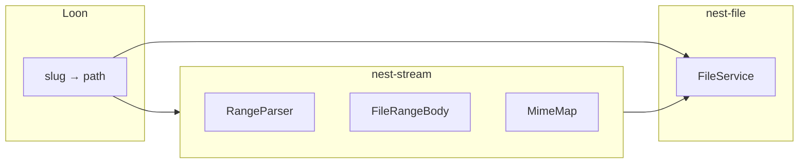

# nest-stream v1 Implementation Plan

## Status: Planned

Placeholder plan for byte-range HTTP file streaming. Crate directory: [`core/crates/nest-stream`](../../core/crates/nest-stream/README.md).

**Prove in Loon first** — implement `loon-server` `services/streaming.rs` per [Loon stream spec](../../apps/loon/docs/v1.md#stream-handler-specification), then extract here.

## Context

[nest-http-serve v1](nest-http-serve-v1.md) defers file streaming (whole-file static only). Loon needs `GET /stream/:slug` with seeking for webOS and VLC.

**Design principle:** `nest-stream` answers *how do we serve bytes from a local file with Range support?* — not *which movie*, *which slug*, or *transcode policy*.

The crate must **not** know about Loon, slugs, TMDB, or media catalogs.

## Crate boundaries

| Crate | Layer | Role |
|-------|-------|------|
| **`nest-stream`** | **core** or **module** (TBD) | Range parse/build, stream body, MIME map |
| `nest-file` | **core** | Open scoped paths, file size |
| `nest-http-serve` | **core** | Optional Axum handler adapter |
| Apps (Loon) | — | Resolve identity → path; mount route |



## Hard boundaries

`nest-stream` **must not**:

- Scan libraries or read SQLite
- Transcode (see `nest-transcode`)
- Accept arbitrary filesystem paths from HTTP — caller passes already-scoped path
- Implement authentication

It **may** depend on:

- `nest-file` (scoped open, metadata)
- `nest-error`
- `tokio`, `tokio-util`, `axum` (body types), `http`, `mime_guess` or static extension map
- `tracing`

## Responsibilities (v1 target)

```text
nest-stream
├── RangeSpec              parsed byte range(s) from Range header
├── RangeParser            If-Match / If-Range deferred
├── FileStreamRequest      path + optional Range header input
├── FileStreamResponse     status, headers, body
├── FileRangeStreamer      open file, seek, read chunk(s)
├── MimeMap                extension → Content-Type
├── stream_file()          top-level async fn
└── StreamError + codes
```

### HTTP behavior (from Loon spec)

| Input | Status | Notes |
|-------|--------|-------|
| No `Range` header | `200` | Full file |
| Valid single range | `206` | `Content-Range`, partial `Content-Length` |
| Multi-range | v0.1: **first range only** | multipart/byteranges deferred |
| Unsatisfiable range | `416` | `Content-Range: bytes */{total}` |
| Missing file | `404` | `StreamError::NotFound` |

Always set `Accept-Ranges: bytes` on success responses.

### Public API (v1 target)

```rust
pub struct FileStreamRequest<'a> {
    pub path: &'a str,           // already scoped — relative to FileService root
    pub range_header: Option<&'a str>,
}

pub struct FileStreamResponse {
    pub status: StatusCode,
    pub content_type: String,
    pub content_length: u64,
    pub content_range: Option<String>,
    pub body: Body,              // axum body or generic Stream
}

pub async fn stream_file(
    file_service: &FileService,
    request: FileStreamRequest<'_>,
) -> StreamResult<FileStreamResponse>;
```

Apps mount:

```rust
// Loon — after slug → relative_path resolution
let response = stream_file(&file_service, FileStreamRequest {
    path: &record.file.relative_path,
    range_header: headers.get("range").map(|v| v.to_str()).flatten(),
}).await?;
```

Optional Axum helper:

```rust
pub fn axum_stream_handler(/* ... */) -> MethodRouter;
```

## Module integration

v0.1 may be **library-only** (no `Module`) — Loon calls `stream_file` directly. Add `StreamModule` only if multiple services need registration.

## v1 scope

### Ship in v1

- Single-range GET support
- `200` full file + `206` partial
- `416` unsatisfiable
- Extension → Content-Type map (mp4, mkv, webm)
- Async read via `tokio::fs::File` + `ReaderStream` or manual buffer
- Unit tests: range parser, status/header builder
- Integration test: temp file + reqwest Range requests

### Explicitly deferred

| Feature | Target |
|---------|--------|
| Multi-range multipart responses | v1.1 |
| `HEAD` support | v1.1 |
| `If-Range` / ETag | v1.2 |
| `nest-http-serve` built-in route macro | v1.1 |
| HLS/DASH packaging | out of scope |

## Extraction from Loon

1. Loon ships M1 with inline `streaming.rs`
2. Copy tests + behavior into `nest-stream`
3. Loon replaces body with `nest_stream::stream_file`
4. Delete duplicated range logic from Loon

## Testing strategy

| Test | Type |
|------|------|
| Parse `bytes=0-1023` | Unit |
| Parse open-ended `bytes=1024-` | Unit |
| 416 when start > file size | Unit |
| End-to-end Range on fixture mp4 | Integration |

## Follow-up

- Implement after Loon M1 stream handler validates behavior
- Link from [nest-http-serve v1](nest-http-serve-v1.md) deferred features
- Update [nest-media v1](nest-media-v1.md) follow-up (mark planned)

## Related

- [nest-stream README](../nest-stream/README.md)
- [Placeholder crate README](../../core/crates/nest-stream/README.md)
- [nest-http-serve v1](nest-http-serve-v1.md)
- [nest-file README](../nest-file/README.md)
- [Loon v1 plan](../../apps/loon/docs/v1.md)
