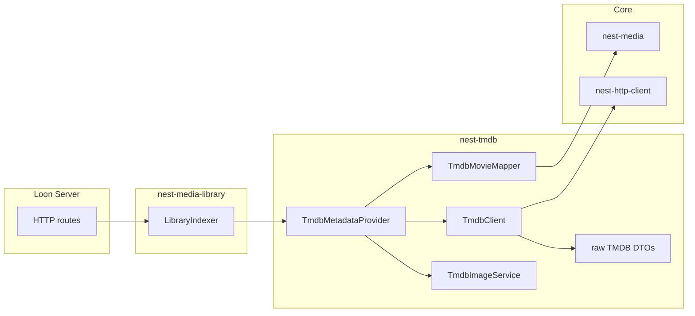

# nest-tmdb v1 Implementation Plan

## Status: Implemented

Implements the `MetadataProvider` adapter deferred from [nest-media v1](nest-media-v1.md) and referenced by [nest-media-library v1](nest-media-library-v1.md).

## Context

[nest-media](../nest-media/README.md) defines **what media is** — `MovieMetadata`, `MovieSearchResult`, and the `MetadataProvider` trait. `nest-tmdb` answers **how do we fetch movie metadata from TMDB and map it into Nest types?**

**Design principle:** `nest-tmdb` is a **provider adapter**, not a media domain crate. It owns TMDB HTTP calls, raw response DTOs, and mapping logic. It does **not** define core media models, serve HTTP, scan libraries, persist to SQLite, or know about Loon or webOS.

TMDB’s typical flow: search for a movie → fetch details (optionally credits, images, external ids). API keys are created from a TMDB account under Settings → API.

## Crate boundaries

| Crate | Layer | Role |
|-------|-------|------|
| `nest-media` | **core** | Domain models + `MetadataProvider` trait |
| **`nest-tmdb`** | **module** | TMDB HTTP client + `MetadataProvider` implementation |
| `nest-http-client` | **core** | Shared async HTTP transport |
| `nest-media-library` | **module** | Injects `MetadataProvider` during library indexing |
| `nest-data-sqlite` | **module** | Persists `Movie` after metadata fetch |



### Hard boundaries

`nest-tmdb` **must not**:

- Define `Movie`, `MediaItem`, or other core media types (use `nest-media`)
- Serve HTTP (`nest-http-serve`)
- Scan filesystems (`nest-file`, `nest-media-library`)
- Open SQLite or implement `MediaLibraryRepository`
- Stream video bytes (`nest-stream`)
- Contain Loon, webOS, or React code

It **may** depend on:

- `nest-media` (trait bounds + target types, `async` + `serde` features)
- `nest-http-client` (`HttpClientService`)
- `nest-core` (`Module`, `AppBuilder`, service registration)
- `nest-error`
- `nest-config` (optional `[tmdb]` section — recommended for Loon)
- `serde`, `serde_json`, `async-trait`, `tracing`, `tokio`

**Optional (deferred):** use shared [nest-cache v1](nest-cache-v1.md) for `/configuration` TTL and metadata blobs (tag `tmdb`). v0.1 may keep an in-memory configuration cache inside `TmdbClient` until `nest-cache` lands.

## Responsibilities

```text
nest-tmdb
├── TmdbConfig              API key, base URLs, language, region
├── TmdbClient              low-level TMDB HTTP calls + DTO deserialization
├── TmdbMetadataProvider    impl MetadataProvider for nest-media
├── TmdbImageService        poster/backdrop URL construction from TMDB paths
├── TmdbMovieMapper         TMDB DTOs → nest-media types
├── TmdbModule              registers client + provider (+ image service)
├── TmdbError               TMDB-specific errors → MediaError / NestError
└── dto/                    internal TMDB response types (not public API)
```

### Design rule

**Apps see Nest media types, not TMDB DTOs.**

Bad:

```rust
let movie: TmdbMovieResponse = client.movie(603).await?;
```

Good:

```rust
let results = provider
    .search_movie(MovieSearchQuery::new("Alien").with_year(1979))
    .await?;
let metadata = provider.get_movie(results[0].external_id.clone()).await?;
```

Raw DTOs live under `src/dto/` and are `pub(crate)` unless needed for testing.

## Public API (v0.1)

### Configuration

```rust
pub struct TmdbConfig {
    pub api_key: String,
    pub base_url: String,
    pub image_base_url: String,
    pub language: String,
    pub region: Option<String>,
}
```

Defaults:

| Field | Default |
|-------|---------|
| `base_url` | `https://api.themoviedb.org/3` |
| `image_base_url` | loaded from `GET /configuration` (fallback `https://image.tmdb.org/t/p/`) |
| `language` | `en-US` |
| `region` | `None` |

Loading:

```rust
// Explicit
let config = TmdbConfig::builder()
    .api_key("...")
    .language("en-US")
    .build()?;

// Environment (TMDB_API_KEY required)
let config = TmdbConfig::from_env()?;

// nest-config [tmdb] section (via TmdbModule::new())
```

### Services

```rust
pub struct TmdbClient { /* ... */ }
pub struct TmdbMetadataProvider { /* ... */ }
pub struct TmdbImageService { /* ... */ }

impl TmdbMetadataProvider {
    pub fn new(client: TmdbClient) -> Self;
}

impl TmdbImageService {
    pub fn poster_url(&self, path: &str, size: ImageSize) -> String;
    pub fn backdrop_url(&self, path: &str, size: ImageSize) -> String;
    pub fn artwork_for_movie(&self, poster_path: Option<&str>, backdrop_path: Option<&str>) -> Vec<Artwork>;
}
```

`ImageSize` is a nest-tmdb enum (`W92`, `W154`, `W342`, `W500`, `W780`, `Original`, etc.) aligned with TMDB image size tokens.

### Implements nest-media

```rust
#[async_trait]
impl MetadataProvider for TmdbMetadataProvider {
    async fn search_movie(
        &self,
        query: MovieSearchQuery,
    ) -> MediaResult<Vec<MovieSearchResult>> {
        // GET /search/movie
    }

    async fn get_movie(
        &self,
        id: ExternalMediaId,
    ) -> MediaResult<MovieMetadata> {
        // GET /movie/{id} + credits + external_ids (+ images for paths)
    }
}
```

**External id convention:** `tmdb:{movie_id}` (e.g. `tmdb:348`). `TmdbMetadataProvider::get_movie` parses this prefix; invalid ids return `MediaError::invalid_input`.

**Search query mapping:** `MovieSearchQuery::query` → TMDB `query` param; `MovieSearchQuery::year` → TMDB `year` param (optional filter).

### Artwork note

`MovieMetadata` in nest-media v0.1 does not include an `artwork` field (`Movie` does). For v0.1:

- `TmdbImageService` centralizes URL building so Loon does not duplicate TMDB image rules.
- `TmdbMovieMapper` extracts `poster_path` / `backdrop_path` from DTOs.
- Apps attach artwork when mapping to `Movie` (e.g. `metadata.into_movie(id)` then merge `artwork_for_movie(...)`).

v0.2 may add optional `artwork: Vec<Artwork>` to `MovieMetadata` in nest-media if every provider needs it on fetch.

## TMDB endpoints (v0.1)

| Endpoint | Purpose |
|----------|---------|
| `GET /search/movie` | Movie search |
| `GET /movie/{movie_id}` | Core movie details |
| `GET /movie/{movie_id}/credits` | Cast and crew |
| `GET /movie/{movie_id}/images` | Poster/backdrop paths (or use paths from movie details) |
| `GET /movie/{movie_id}/external_ids` | IMDb id, etc. |
| `GET /configuration` | Image base URL + size tokens |

**Auth:** v3 API key as query parameter `api_key=...` on all requests (standard TMDB v3 integration).

**Optimization (deferred v0.2):** single request with `append_to_response=credits,external_ids,images` instead of multiple round-trips.

## Mapping (TmdbMovieMapper)

| TMDB field | nest-media field |
|------------|------------------|
| `id` | `ExternalMediaId` (`tmdb:{id}`) + `ExternalIds.tmdb_id` |
| `imdb_id` (from external_ids) | `ExternalIds.imdb_id` |
| `title` | `title` |
| `original_title` | `original_title` |
| `release_date` (year) | `year` |
| `runtime` (minutes) | `runtime_seconds` (`runtime * 60`) |
| `overview` | `summary` |
| `genres[].name` | `genres` |
| cast `name`, `character` | `cast: Vec<PersonCredit>` |
| crew `name`, `job` (Director, etc.) | `crew: Vec<PersonCredit>` |
| `poster_path`, `backdrop_path` | via `TmdbImageService` → `Artwork` (app-side merge) |

Search results map to `MovieSearchResult` with `external_id`, `title`, `year`, `summary` (overview snippet).

## Module integration

Follow [nest-airtable](../../modules/crates/nest-airtable/src/module.rs):

```rust
pub const TMDB_MODULE_ID: ModuleId = ModuleId("nest-tmdb");

pub struct TmdbModule {
    config: Option<TmdbConfig>,
}

impl Module for TmdbModule {
    fn dependencies(&self) -> &'static [ModuleId] {
        &[HTTP_CLIENT_MODULE_ID]
    }

    fn configure(&self, app: &mut AppBuilder) -> NestResult<()> {
        let http = app.service_mut::<HttpClientService>()?.clone();
        let config = /* explicit or ConfigService [tmdb] */;
        let client = TmdbClient::new(http, config)?;
        let images = TmdbImageService::new(client.configuration());
        let provider = TmdbMetadataProvider::new(client);
        app.register_service(client)?;
        app.register_service(images)?;
        app.register_service(provider)?;
        Ok(())
    }
}
```

`nest-media-library` accepts `Arc<dyn MetadataProvider>` — Loon wires:

```rust
AppBuilder::new()
    .module(HttpClientModule::default())
    .module(TmdbModule::new())
    .module(FileModule::scoped(media_root))
    .module(MediaLibraryModule::new().with_metadata(
        app.service::<TmdbMetadataProvider>()? // or Arc<dyn MetadataProvider>
    ))
```

Registering `TmdbMetadataProvider` as `Arc<dyn MetadataProvider>` is an app concern; the module registers the concrete type.

## Error model

Own error type (map to `MediaError` at the provider boundary):

- `TmdbError` + `TmdbErrorKind` (`Config`, `Http`, `Api`, `Parse`, `NotFound`, `RateLimit`)
- `TmdbResult<T>`
- `NEST_TMDB_*` codes in `codes.rs`
- `impl From<TmdbError> for NestError`
- `TmdbMetadataProvider` converts `TmdbError` → `MediaError::provider(...)` for trait methods

Map `HttpClientError` / `NestError` from HTTP layer at boundaries. Treat TMDB `404` as `MediaError::not_found` where appropriate.

## Workspace layout

**Module path** (not core):

```text
modules/crates/nest-tmdb/
├── Cargo.toml
└── src/
    ├── lib.rs
    ├── prelude.rs
    ├── codes.rs
    ├── config.rs
    ├── error.rs
    ├── client.rs
    ├── provider.rs
    ├── images.rs
    ├── mapper.rs
    ├── module.rs
    └── dto/
        ├── mod.rs
        ├── search.rs
        ├── movie.rs
        ├── credits.rs
        ├── images.rs
        ├── external_ids.rs
        └── configuration.rs
```

Docs: `docs/nest-tmdb/README.md` (created at implementation time).

Root `Cargo.toml`: add `modules/crates/nest-tmdb` to members + workspace dependencies.

### Draft `Cargo.toml`

```toml
[package]
name = "nest-tmdb"
version = "0.1.0"
edition.workspace = true
# ...

[dependencies]
nest-core = { workspace = true }
nest-error = { workspace = true }
nest-http = { workspace = true, features = ["serde"] }
nest-http-client = { workspace = true }
nest-media = { workspace = true, features = ["async", "serde"] }
nest-config = { workspace = true, optional = true }
async-trait = "0.1"
serde = { version = "1", features = ["derive"] }
serde_json = "1"
tracing = "0.1"
tokio = { version = "1", features = ["time"] }

[features]
default = ["config"]
config = ["dep:nest-config"]

[dev-dependencies]
nest-core = { workspace = true }
nest-config = { workspace = true }
tokio = { version = "1", features = ["macros", "rt-multi-thread"] }
wiremock = "0.6"
```

## Loon usage

```rust
// Search + fetch (direct provider use)
let tmdb = ctx.service::<TmdbMetadataProvider>()?;
let results = tmdb
    .search_movie(MovieSearchQuery::new("Alien").with_year(1979))
    .await?;
let metadata = tmdb.get_movie(results[0].external_id.clone()).await?;

// Library indexing (injected provider)
let indexer = ctx.service::<LibraryIndexer>()?;
let result = indexer
    .scan_library(&config, LibraryScanOptions {
        fetch_metadata: true,
        ..Default::default()
    })
    .await?;
```

HTTP routes (`GET /api/movies/search`, etc.) live in **Loon**, not this crate.

```text
loon-server
├── nest-http-serve
├── nest-media
├── nest-media-library
├── nest-tmdb              ← MetadataProvider
├── nest-file
├── nest-data-sqlite
└── nest-config
```

## v0.1 scope checklist

### Ship in v0.1

- [x] `TmdbConfig` (builder, `from_env`, optional `[tmdb]` via nest-config)
- [x] `TmdbClient` — movie search, movie details, credits, external ids, configuration
- [x] Internal DTOs for v0.1 endpoints
- [x] `TmdbMovieMapper` — DTOs → `MovieSearchResult`, `MovieMetadata`, `ExternalIds`, `PersonCredit`
- [x] `TmdbImageService` — poster/backdrop URL builders + `artwork_for_movie`
- [x] `TmdbMetadataProvider` — `impl MetadataProvider`
- [x] `TmdbModule` + service registration
- [x] `TmdbError` + `NestError` / `MediaError` mapping
- [x] Unit tests: mapper fixtures, image URL builder
- [x] Integration tests: wiremock for search + get_movie

### Explicitly deferred

| Feature | Target |
|---------|--------|
| TV shows / seasons / episodes | v0.2+ |
| `append_to_response` batching | v0.2 |
| Shared [nest-cache](nest-cache-v1.md) module | v0.2 (in-memory config cache OK in v0.1) |
| Watch providers / ratings by country | later |
| Recommendations / trending | later |
| Person profiles | later |
| Reviews / lists | later |
| Account / session auth (TMDB v4 user flows) | later |
| `artwork` on `MovieMetadata` | nest-media v0.2 if needed |
| **`MovieFetchResult` + `fetch_movie`** | [v1.1 plan](nest-tmdb-v1.1-artwork-fetch.md) — Loon artwork paths |

## Testing strategy

| Test | Type |
|------|------|
| `TmdbMovieMapper` field mapping | Unit (JSON fixtures from TMDB samples) |
| `TmdbImageService` URL building | Unit |
| `ExternalMediaId` parse (`tmdb:348`) | Unit |
| `search_movie` / `get_movie` | Integration (wiremock) |
| `TmdbModule` registers services | Unit |
| `TmdbError` → `MediaError` / `NestError` | Unit |

Use recorded TMDB JSON fixtures in `tests/fixtures/` — **do not** call live TMDB in CI (API key + rate limits).

## Follow-up

- Implement `modules/crates/nest-tmdb` per this plan
- Add `docs/nest-tmdb/README.md`
- Loon: wire `TmdbModule` + inject into `MediaLibraryModule` — [Loon v1 plan](../../apps/loon/docs/v1.md) (product repo)
- [nest-tmdb v1.1 artwork fetch](nest-tmdb-v1.1-artwork-fetch.md) — `MovieFetchResult` for Loon enrichment
- Plan [nest-transcode-v1.md](nest-transcode-v1.md) (`MediaInspector` via FFprobe)

## Related

- [nest-media v1](nest-media-v1.md) — domain models and `MetadataProvider` trait
- [nest-media-library v1](nest-media-library-v1.md) — library indexing with injected metadata
- [nest-http-client README](../nest-http-client/README.md) — HTTP transport
- [nest-airtable v1](nest-airtable-v1.md) — similar module + HTTP client pattern
- [Loon README](../../apps/loon/README.md)
- [architecture.md](../architecture.md)
