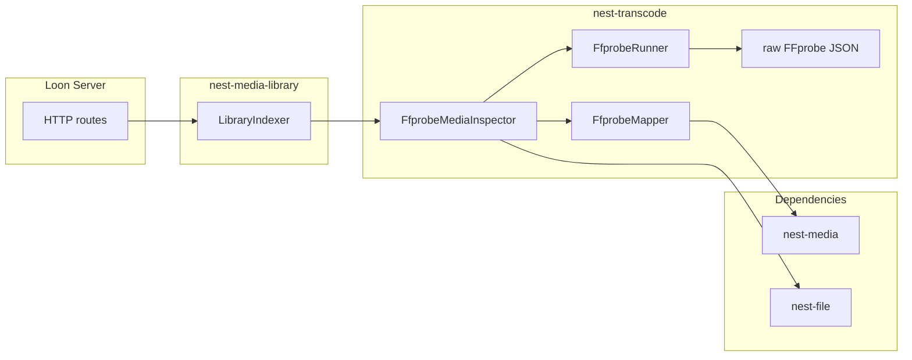

# nest-transcode v1 Implementation Plan

## Status: Implemented

Implements the `MediaInspector` adapter deferred from [nest-media v1](nest-media-v1.md) and referenced by [nest-media-library v1](nest-media-library-v1.md).

## Context

[nest-media](../nest-media/README.md) defines **what inspected media looks like** — `MediaInput`, `MediaInspection`, `MediaTracks`, and the `MediaInspector` trait. `nest-transcode` answers **how do we probe local files and map technical metadata into Nest types?**

**Design principle:** `nest-transcode` is a **provider adapter and FFmpeg integration module**, not a media domain crate. v0.1 focuses on **FFprobe inspection** only. Full FFmpeg transcode job orchestration is explicitly deferred — the crate name reflects the long-term home for both probe and transcode, but v0.1 ships inspection so Loon can index track metadata without implementing a transcode pipeline yet.

Loon’s philosophy is direct playback whenever possible; inspection supports compatibility decisions and library metadata, not mandatory transcoding.

The crate must **not** know about Loon, webOS, or any specific app.

## Crate boundaries

| Crate | Layer | Role |
|-------|-------|------|
| `nest-media` | **core** | Domain models + `MediaInspector` trait |
| **`nest-transcode`** | **module** | FFprobe execution + `MediaInspector` implementation |
| `nest-file` | **core** | Resolve scoped library paths before probing |
| `nest-media-library` | **module** | Injects `MediaInspector` during library indexing |
| `nest-stream` (future) | **module** | Byte-range streaming of existing files |
| `nest-tmdb` | **module** | Metadata enrichment (separate concern) |



### Hard boundaries

`nest-transcode` **must not**:

- Define `Movie`, `MediaItem`, or other core media types (use `nest-media`)
- Serve HTTP or stream video bytes (`nest-http-serve`, `nest-stream`)
- Scan library directories (`nest-media-library`)
- Call TMDB or persist to SQLite
- Contain Loon, webOS, or React code

It **may** depend on:

- `nest-media` (trait bounds + target types, `async` feature)
- `nest-file` (`FileService` for scoped path resolution — required for library-relative paths)
- `nest-core` (`Module`, `AppBuilder`, service registration)
- `nest-error`
- `nest-config` (optional `[transcode]` section)
- `nest-task` (optional — long probes via `spawn_blocking`; v0.1 uses tokio directly)
- `serde`, `serde_json`, `async-trait`, `tracing`, `tokio`

It **must not** depend on `nest-http-client`, `nest-tmdb`, or database crates.

## Responsibilities

```text
nest-transcode (v0.1)
├── TranscodeConfig           FFprobe binary path, timeout, probe flags
├── FfprobeRunner             executes ffprobe, captures JSON stdout
├── FfprobeMapper             FFprobe JSON → MediaInspection / MediaTracks
├── FfprobeMediaInspector     impl MediaInspector for nest-media
├── TranscodeModule           registers inspector (+ runner)
├── TranscodeError            probe errors → MediaError / NestError
└── dto/                      internal FFprobe JSON types (not public API)

Deferred (v0.2+)
├── TranscodeJob              FFmpeg transcode job descriptor
├── TranscodeQueue            job scheduling / cancellation
├── FfmpegRunner              spawns ffmpeg with progress parsing
└── TranscodeTask             nest-task wrapper for background jobs
```

### Design rule

**Apps see Nest media types, not FFprobe JSON.**

Bad:

```rust
let json: FfprobeOutput = runner.probe(path).await?;
```

Good:

```rust
let inspection = inspector
    .inspect(MediaInput::LocalPath("Movies/Alien (1979)/Alien.mkv".into()))
    .await?;
```

Raw DTOs live under `src/dto/` and are `pub(crate)`.

## Public API (v0.1)

### Configuration

```rust
pub struct TranscodeConfig {
    pub ffprobe_path: String,
    pub timeout_seconds: u32,
    pub extra_ffprobe_args: Vec<String>,
}
```

Defaults:

| Field | Default |
|-------|---------|
| `ffprobe_path` | `"ffprobe"` (resolved via `PATH`) |
| `timeout_seconds` | `60` |
| `extra_ffprobe_args` | `[]` |

Loading:

```rust
// Builder
let config = TranscodeConfig::builder()
    .ffprobe_path("/usr/bin/ffprobe")
    .timeout_seconds(120)
    .build()?;

// Environment (optional FFPROBE_PATH override)
let config = TranscodeConfig::from_env()?;

// nest-config [transcode] section (via TranscodeModule::new())
```

Optional v0.1 stretch: store `ffmpeg_path` in config for forward compatibility but **do not use it** until v0.2.

### Services

```rust
pub struct FfprobeRunner { /* ... */ }
pub struct FfprobeMediaInspector { /* ... */ }

impl FfprobeMediaInspector {
    pub fn new(config: TranscodeConfig, files: FileService) -> Self;
}

impl FfprobeRunner {
    pub async fn probe_file(&self, absolute_path: &Path) -> TranscodeResult<FfprobeOutput>;
}
```

### Implements nest-media

```rust
#[async_trait]
impl MediaInspector for FfprobeMediaInspector {
    async fn inspect(&self, input: MediaInput) -> MediaResult<MediaInspection> {
        match input {
            MediaInput::LocalPath(path) => {
                let resolved = self.resolve_path(&path)?;
                let output = tokio::task::spawn_blocking(move || {
                    // FfprobeRunner sync API inside blocking pool
                }).await??;
                Ok(FfprobeMapper::to_inspection(&output))
            }
        }
    }
}
```

**Path resolution:** `MediaInput::LocalPath` from `nest-media-library` is **relative to `FileService` scope**. `FfprobeMediaInspector` holds a `FileService` clone and resolves to an absolute path before invoking FFprobe. If resolution fails, return `MediaError::invalid_input` or `MediaError::inspection`.

**Async model:** FFprobe is a sync subprocess. The async trait method runs probe work in `tokio::task::spawn_blocking` (same guidance as [nest-file](../nest-file/README.md) for heavy sync I/O).

## FFprobe invocation (v0.1)

Standard probe command:

```bash
ffprobe \
  -v quiet \
  -print_format json \
  -show_format \
  -show_streams \
  -show_stream_groups \
  <absolute-path>
```

`-show_stream_groups` is optional v0.1 stretch for Dolby Vision / advanced HDR detection; basic HDR can use stream `side_data_list` when present.

### Mapping (FfprobeMapper)

| FFprobe source | nest-media field |
|----------------|----------------|
| `format.format_name` | `MediaInspection.container` |
| `format.duration` (float seconds) | `MediaInspection.duration_seconds` |
| stream `codec_type=video` | `VideoTrack` |
| `codec_name` | `VideoTrack.codec` |
| `width`, `height` | `VideoTrack.width`, `VideoTrack.height` |
| `bit_rate` | `VideoTrack.bitrate` |
| HDR side data (`side_data_type`) | `VideoTrack.hdr` → `HdrFormat` |
| stream `codec_type=audio` | `AudioTrack` |
| `tags.language`, `tags.title` | `AudioTrack.language`, `AudioTrack.title` |
| channel layout / `channels` | `AudioTrack.channels` |
| stream `codec_type=subtitle` | `SubtitleTrack` |
| `tags.language`, `tags.title` | `SubtitleTrack.language`, `SubtitleTrack.title` |
| `disposition.forced`, `disposition.default` | `SubtitleTrack.forced`, `SubtitleTrack.is_default` |

Pick the **first video stream** as primary for v0.1. Include all audio and subtitle streams.

## Module integration

Follow [nest-tmdb](../../modules/crates/nest-tmdb/src/module.rs) and [nest-media-library](../../modules/crates/nest-media-library/src/module.rs):

```rust
pub const TRANSCODE_MODULE_ID: ModuleId = ModuleId("nest-transcode");

pub struct TranscodeModule {
    config: Option<TranscodeConfig>,
}

impl Module for TranscodeModule {
    fn dependencies(&self) -> &'static [ModuleId] {
        &[FILE_MODULE_ID]
    }

    fn configure(&self, app: &mut AppBuilder) -> NestResult<()> {
        let files = app.service_mut::<FileService>()?.clone();
        let config = /* explicit or ConfigService [transcode] */;
        let runner = FfprobeRunner::new(config.clone())?;
        let inspector = FfprobeMediaInspector::new(config, files, runner);
        app.register_service(runner)?;
        app.register_service(inspector)
    }
}
```

Loon wiring with library indexing:

```rust
AppBuilder::new()
    .module(FileModule::scoped(media_root))
    .module(TranscodeModule::new())
    .module(TmdbModule::new())
    .module(
        MediaLibraryModule::new()
            .with_inspector(/* Arc<dyn MediaInspector> from FfprobeMediaInspector */)
            .with_metadata(/* TmdbMetadataProvider */)
    )
```

## Error model

Own error type (map to `MediaError` at the provider boundary):

- `TranscodeError` + `TranscodeErrorKind` (`Config`, `BinaryNotFound`, `Probe`, `Parse`, `Timeout`, `Io`)
- `TranscodeResult<T>`
- `NEST_TRANSCODE_*` codes in `codes.rs`
- `impl From<TranscodeError> for NestError`
- `FfprobeMediaInspector` converts `TranscodeError` → `MediaError::inspection(...)` for trait methods

| Condition | Maps to |
|-----------|---------|
| FFprobe exit non-zero | `TranscodeErrorKind::Probe` |
| JSON parse failure | `TranscodeErrorKind::Parse` |
| Probe timeout | `TranscodeErrorKind::Timeout` |
| Missing ffprobe binary | `TranscodeErrorKind::BinaryNotFound` |
| Path resolution failure | `MediaError::invalid_input` or `inspection` |

## Workspace layout

**Module path** (not core):

```text
modules/crates/nest-transcode/
├── Cargo.toml
└── src/
    ├── lib.rs
    ├── prelude.rs
    ├── codes.rs
    ├── config.rs
    ├── error.rs
    ├── runner.rs
    ├── mapper.rs
    ├── inspector.rs
    ├── module.rs
    └── dto/
        ├── mod.rs
        ├── format.rs
        └── stream.rs
```

Docs: `docs/nest-transcode/README.md` (created at implementation time).

Root `Cargo.toml`: add `modules/crates/nest-transcode` to members + workspace dependencies.

### Draft `Cargo.toml`

```toml
[package]
name = "nest-transcode"
version = "0.1.0"
edition.workspace = true
# ...

[dependencies]
nest-core = { workspace = true }
nest-error = { workspace = true }
nest-file = { workspace = true }
nest-media = { workspace = true, features = ["async"] }
nest-config = { workspace = true, optional = true }
async-trait = "0.1"
serde = { version = "1", features = ["derive"] }
serde_json = "1"
tracing = "0.1"
tokio = { version = "1", features = ["process", "time", "rt-multi-thread"] }

[features]
default = ["config"]
config = ["dep:nest-config"]

[dev-dependencies]
nest-core = { workspace = true }
nest-config = { workspace = true }
tokio = { version = "1", features = ["macros", "rt-multi-thread"] }
```

## Loon usage

```rust
// Direct inspection
let inspector = ctx.service::<FfprobeMediaInspector>()?;
let inspection = inspector
    .inspect(MediaInput::LocalPath("Movies/Alien.mkv".into()))
    .await?;

// Library indexing (injected inspector)
let indexer = ctx.service::<LibraryIndexer>()?;
let result = indexer
    .scan_library(&config, LibraryScanOptions {
        inspect_files: true,
        ..Default::default()
    })
    .await?;
```

HTTP routes live in **Loon**, not this crate.

```text
loon-server
├── nest-http-serve
├── nest-media
├── nest-media-library
├── nest-transcode         ← MediaInspector (FFprobe)
├── nest-tmdb
├── nest-file
├── nest-stream            ← future direct streaming
└── nest-config
```

## v0.1 scope checklist

### Ship in v0.1

- [x] `TranscodeConfig` (builder, `from_env`, optional `[transcode]` via nest-config)
- [x] `FfprobeRunner` — spawn ffprobe, capture JSON, timeout handling
- [x] Internal DTOs for `format` + `streams`
- [x] `FfprobeMapper` — JSON → `MediaInspection`, `MediaTracks`, `HdrFormat`
- [x] `FfprobeMediaInspector` — `impl MediaInspector` with `FileService` path resolution
- [x] `TranscodeModule` + service registration (depends on `nest-file`)
- [x] `TranscodeError` + `NestError` / `MediaError` mapping
- [x] Unit tests: mapper fixtures from recorded FFprobe JSON
- [x] Integration test: probe sample file (skip if `ffprobe` not installed)

### Explicitly deferred

| Feature | Target |
|---------|--------|
| FFmpeg transcode jobs | v0.2 |
| HLS / fMP4 packaging | v0.2+ |
| Thumbnail / poster generation | v0.2 |
| Hardware acceleration selection | v0.2 |
| Transcode progress events | v0.2 (`nest-task`) |
| Batch probe during scan parallelism tuning | v0.2 |
| Remote / URL inputs (`MediaInput` extension) | nest-media v0.2 |
| Subtitle extraction | v0.2 |

## Testing strategy

| Test | Type |
|------|------|
| `FfprobeMapper` video/audio/subtitle mapping | Unit (JSON fixtures in `tests/fixtures/`) |
| HDR side-data → `HdrFormat` | Unit |
| Path resolution via mock `FileService` | Unit |
| `inspect` end-to-end | Integration (requires ffprobe + tiny sample `.mkv`) |
| `TranscodeModule` registers services | Unit |
| `TranscodeError` → `MediaError` / `NestError` | Unit |

Record FFprobe JSON fixtures from real files once; **do not** require FFmpeg install for unit tests. Gate integration tests with `#[ignore]` or env var `NEST_FFPROBE_TEST=1`.

Example fixture sources: H.264 + AAC `.mp4`, multi-audio `.mkv`, embedded subtitles, optional HDR sample.

## Relationship to other crates

| Crate | Relationship |
|-------|----------------|
| `nest-media` | Defines `MediaInspector` contract and result types |
| `nest-media-library` | Calls inspector during `LibraryScanOptions.inspect_files` |
| `nest-stream` | Serves bytes; may *read* inspection results for compatibility but does not probe |
| `nest-tmdb` | Provider metadata (title, cast) — orthogonal to technical probe |

**Key decision:** Keep **metadata** (TMDB) and **inspection** (FFprobe) as separate injected providers. `nest-transcode` does not merge them.

## Follow-up

- Implement `modules/crates/nest-transcode` per this plan
- Add `docs/nest-transcode/README.md`
- Loon: wire `TranscodeModule` + inject into `MediaLibraryModule`
- Plan `nest-stream-v1.md` — byte-range streaming

## Related

- [nest-media v1](nest-media-v1.md) — domain models and `MediaInspector` trait
- [nest-media-library v1](nest-media-library-v1.md) — library indexing with injected inspector
- [nest-tmdb v1](nest-tmdb-v1.md) — metadata provider (implemented)
- [nest-file README](../nest-file/README.md) — scoped path resolution
- [Loon README](../../apps/loon/README.md)
- [architecture.md](../architecture.md)
